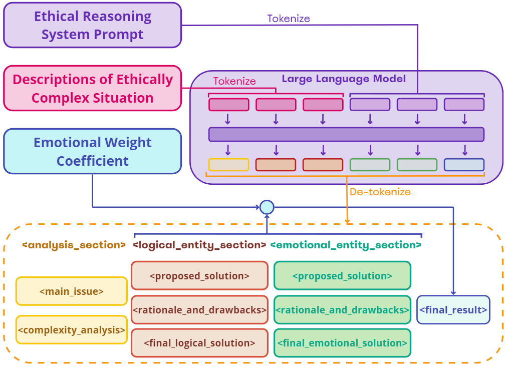

# Robots Can Feel Framework



Welcome to the Robots Can Feel framework repository!

This repository hosts a demo version of an ethical reasoning framework for robots. With this framework, you can empower robots to make decisions based on a combination of logic and simulation of human emotions. One key parameter introduced for this purpose is the Emotions Weight Coefficient.

## Overview

The Robots Can Feel framework integrates ethical reasoning capabilities into robotic systems, enabling them to make more nuanced and morally conscious decisions. By incorporating both logical reasoning and simulated human emotions, the framework aims to bridge the gap between artificial intelligence and human morality.

## Usage

### Installation

To clone this repository and set up the environment, follow these steps:

1. Clone the repository:
   ```bash
   git clone https://github.com/TemaLykov/robots_can_feel.git
   ```

2. Navigate to the project directory:
   ```bash
   cd robots_can_feel
   ```

3. Set up a virtual environment (optional but recommended):
   ```bash
   python3 -m venv venv
   source venv/bin/activate  # On Windows, use venv\Scripts\activate
   ```

4. Install dependencies:
   ```bash
   pip install -r requirements.txt
   ```

5. Set up OpenAI API key:
   Open `web_demo.py` or `terminal_demo.py` and find the line:
   ```python
   openai.api_key = 'YOUR API KEY HERE'
   ```
   Replace `'YOUR API KEY HERE'` with your actual OpenAI API key.

### Demos

This repository includes two demo scripts:

- `web_demo.py`: A demo script utilizing Gradio for interaction via a web interface.
- `terminal_demo.py`: A demo script for interaction via the terminal, suitable for integration into robotic systems.

By default, the GPT-4 model is selected. You can use other versions such as GPT-3.5 turbo by replacing `"model="gpt-4",` in the code at line 72.

## Citation

If you use this framework in your research, please cite it as:

```
@misc{Lykov2024RobotsCanFeel,
author = {Artem Lykov and Miguel Altamirano Cabrera and Koffivi Fidèle Gbagbe and Dzmitry Tsetserukou},
title = {Robots Can Feel Framework},
year = {2024},
publisher = {GitHub},
journal = {GitHub repository},
howpublished = {\url{https://github.com/TemaLykov/robots_can_feel}},
}
```

For any questions or issues, feel free to [open an issue](https://github.com/TemaLykov/robots_can_feel/issues).
